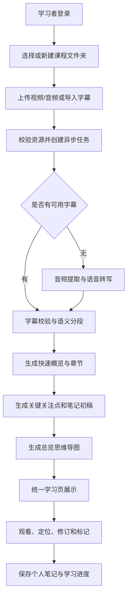

# 课览 CourseLens

> 面向视频课程的智能预习与可编辑笔记工作台。
>
> **先览全课，再学重点。**

课览（CourseLens）帮助学习者把自己有权处理的视频、音频或字幕资料，转化为课程概览、章节结构、关键关注点、带时间定位的 AI 笔记初稿和思维导图。学习者无需一边播放一边频繁暂停抄写，而是在 AI 初稿上核对、补充和修订，把注意力放在理解原理、判断准确性和形成个人认识上。

| 选题要素 | 说明 |
| --- | --- |
| 项目名称 | 课览 CourseLens |
| 项目简介 | 覆盖课程导入、异步处理、课前预览、AI 笔记、思维导图和个人修订的视频学习工作台 |
| 业务背景 | 视频课程按时间线性呈现，学习者课前难以了解全貌，观看时频繁暂停抄写会打断思考，课后笔记又难以定位原视频核对 |
| 目标用户 | 学习高校课程、公开课、技术教程和岗位培训视频的学生、自学者与职业学习者；管理员负责保障用户、资源和处理任务正常运行 |

**作业记录：**[Week 02：项目选题与功能规划](docs/homework/week-02/index.md) · [Week 03：Spring Boot 工程与运行验证](docs/homework/week-03/index.md) · [项目选题简案](docs/project-proposal.md)

---

## 1. 项目背景

在线视频课程具有时长长、信息线性呈现、重点分布不均等特点。传统学习方式通常是“播放视频 → 遇到重点暂停 → 抄录内容 → 恢复播放 → 课后再次整理”。这种方式存在以下问题：

- 看视频前不了解课程主题、难度、章节结构和重点，难以判断是否值得学习以及需要投入多少时间；
- 观看过程中频繁暂停记录，注意力不断在“抄写”和“理解”之间切换，难以连续思考知识原理；
- 大部分情况下只是先把内容抄下来，再进行记忆和理解，学习效率明显下降；
- 课后笔记零散，发现疑问时难以快速返回视频对应片段核对；
- 转写和 AI 内容生成耗时较长，需要明确的处理进度、失败原因和重试机制。

课览的目标不是代替学习者学习，而是把“从零抄写”转变为“基于可靠初稿进行理解、核对、修订与补充”，形成“**预览 → 观看 → 修订 → 复习**”的学习闭环。

### 1.1 选择该题目的原因

1. **来自真实学习需求**：网课学习中的课前不了解内容、暂停抄写和笔记难复用是高频问题；
2. **业务价值明确**：项目重点是提高预习、理解与笔记整理效率，而不是简单保存或播放视频；
3. **角色与流程足够丰富**：包含学习者、管理员和内容处理组件，覆盖资源、任务、内容、修订、共享与审计；
4. **适合持续演进**：可从模块化单体开始，后续逐步加入数据库、认证、消息、服务拆分、事务、监控和部署；
5. **范围可以控制**：第一阶段使用本地文件和字幕输入，避免多平台下载、版权和反爬问题掩盖核心业务。

---

## 2. 项目目标与适用场景

### 2.1 核心目标

1. **课程预览**：正式观看前，让学习者了解课程讲什么、适合谁、章节如何组织、重点在哪里；
2. **笔记提效**：自动生成带来源定位的结构化笔记初稿，学习者只需修订、补充和标注个人理解；
3. **结构总结**：自动生成课程思维导图，帮助建立整体知识框架并用于课后复习；
4. **过程可控**：让转写和内容生成任务可查询、可重试、可恢复、可审计；
5. **持续演进**：保证后续课程要求可以在同一项目上逐步实现，而不需要更换题目。

其中，**课前预览和 AI 笔记初稿并列为最高优先级，思维导图为次级核心价值**。

### 2.2 适用场景

- 学生预习和学习高校课程、公开课及考试辅导视频；
- 开发者学习技术教程、框架讲解和项目实战视频；
- 职业学习者整理岗位培训、行业课程和会议回放；
- 学习者处理自己录制或已经获得处理权限的视频、音频与字幕资料。

---

## 3. 用户角色与需求

| 角色 | 核心需求 | 主要职责与权限 |
| --- | --- | --- |
| 学习者 | 看课前掌握课程框架，减少抄写时间，形成可复习的个人笔记 | 上传并归类课程；查看概览、章节、笔记和导图；编辑个人笔记；定位原视频；按需共享内容；管理学习标记 |
| 管理员 | 保障账号、资源和异步任务正常运行 | 查看任务状态与失败原因；重试或终止异常任务；管理用户状态与资源；查看指标和审计记录 |
| 内容处理组件 | 将课程资源稳定转化为学习资料 | 以任务标识执行媒体预处理、转写、章节切分、概览/笔记/导图生成并回传状态 |

> 内容处理组件不是人类用户，但它是重要的业务参与方，用于体现异步任务、消息通信、失败补偿和后续服务拆分。

---

## 4. 核心业务流程



处理失败时，系统记录失败阶段、原因和尝试次数。暂时性网络或服务错误可自动重试，学习者和管理员也可按权限发起有限次数的人工重试。重试优先从已经成功的阶段继续，不重复执行不必要的转写，也不会覆盖学习者已经保存的个人修订。

### 4.1 统一学习页的信息顺序

统一学习页按以下顺序组织内容：

1. **快速概览**：课程主题、适合人群、前置知识、学习收获和预计投入；
2. **章节路线**：章节标题、时间范围、核心问题和主要知识点；
3. **关键关注点**：优先覆盖原理、难点、考试或实践价值、常见误区；
4. **课程笔记**：按章节生成的可编辑 AI 笔记初稿；
5. **总览导图**：以“课程—章节—知识点—细节”展示知识结构。

用户点击章节、笔记条目或导图节点时，可以跳转到关联的视频时间位置；没有时间戳依据的内容只显示文本来源，不伪造精确跳转。

---

## 5. 功能模块

### 5.1 用户与权限

| 功能 | 说明 |
| --- | --- |
| 注册与登录 | 支持学习者和管理员登录，恢复用户会话 |
| 角色权限 | 区分学习者与管理员操作范围 |
| 资源级授权 | 校验课程、任务、字幕、笔记和导图是否属于当前用户或已公开共享 |
| 操作审计 | 记录管理员重试、终止任务、账号管理和资源治理等敏感操作 |

### 5.2 课程资源管理

| 功能 | 说明 |
| --- | --- |
| 本地文件上传 | 上传自己有权处理的视频或音频，校验类型、大小、时长和上传状态 |
| 字幕文本导入 | 支持 SRT、VTT 和 UTF-8 文本，作为已有字幕输入或转写降级方案 |
| 文件夹归类 | 上传前选择或新建文件夹，课程可以移动；删除文件夹时课程回到“未分类” |
| 课程信息 | 维护标题、简介、标签、来源说明、封面、总时长和学习状态 |
| 分类与检索 | 按文件夹、标签、状态、创建时间和关键词查找课程 |

### 5.3 智能处理任务

| 功能 | 说明 |
| --- | --- |
| 任务创建 | 每次处理生成独立任务，并避免相同资源和配置被重复处理 |
| 异步执行 | 上传完成后进入处理队列，页面不阻塞等待模型返回 |
| 转写与分段 | 提取音频并转写，或校验导入字幕；按时间、语义和章节进行切分 |
| 状态反馈 | 展示等待、转写中、生成中、已完成和失败状态 |
| 失败重试 | 区分可重试与不可重试错误，记录失败阶段、尝试次数和终止原因 |
| 幂等控制 | 重复消息或请求不会产生多个同时生效的内容版本 |

### 5.4 课程预览

| 功能 | 说明 |
| --- | --- |
| 快速概览 | 展示主题、适合人群、前置知识、预计收获、总时长和整体摘要 |
| 章节路线 | 按章节展示标题、核心问题、知识点和视频时间范围 |
| 关键关注点 | 优先说明原理、理解难点、考试或实践价值和常见误区 |
| 来源追溯 | 章节和重点关联字幕片段或时间范围，方便核对 AI 内容 |
| 详情级别 | 后续支持精简、标准和详细三种展示密度 |

### 5.5 AI 辅助笔记

| 功能 | 说明 |
| --- | --- |
| 笔记初稿 | 按章节生成概念、解释、案例、步骤和易错点等结构化内容 |
| 自动重点 | AI 初稿自动用结构化粗体标识核心重点，用户可以调整或取消 |
| 时间戳关联 | 笔记块关联一个或多个字幕片段及时间区间，点击后可回看核对 |
| 个人修订 | 支持编辑、补充、删除、高光、下划线、波浪线、双横线、段落标注和疑问标记 |
| 初稿与个人版 | 分层保存 AI 初稿和个人修订，重新生成时不静默覆盖用户内容 |
| 对照与合并 | 后续支持同屏查看 AI 初稿与个人版，接受、拒绝或合并 AI 建议 |
| 版本与导出 | 后续支持差异查看及 Markdown 等格式导出 |

### 5.6 思维导图与复习

| 功能 | 说明 |
| --- | --- |
| 导图生成 | 生成“课程—章节—知识点—细节”层级化导图 |
| 内容联动 | 点击节点跳转到关联章节、笔记或视频时间位置 |
| 导图编辑 | 后续支持修改节点标题、说明和层级关系 |
| 学习标记 | 将知识点标为已掌握、待复习或不理解 |
| 复习清单 | 根据学习标记汇总个人待复习内容 |

### 5.7 社区共享与相关推荐

| 功能 | 说明 |
| --- | --- |
| 分层共享 | 课程默认私有；用户可分别选择共享 AI 生成内容或个人修订笔记 |
| 公开内容浏览 | 学习者可查看他人主动公开的概览、笔记和导图，但不能修改原作者内容 |
| 相关内容推荐 | 后续根据课程标题、章节、字幕知识点和内容向量推荐相关视频与笔记 |
| 隐私边界 | 只共享 AI 内容时不公开个人修订；原始媒体、私有文件夹和学习记录不随笔记共享 |
| 取消共享 | 取消后内容立即停止进入新的检索和推荐结果 |

### 5.8 管理与运营

| 功能 | 说明 |
| --- | --- |
| 用户管理 | 查看用户状态，禁用或启用异常账号并记录原因 |
| 任务管理 | 查看任务状态、耗时、失败阶段、失败原因和重试记录 |
| 资源治理 | 处理重复、异常或不合规的资源记录 |
| 通知中心 | 在任务完成、失败或重试结束后通知相关学习者 |
| 系统指标 | 展示任务成功率、平均耗时、失败类型和队列积压量 |

---

## 6. 当前范围与暂不实现内容

### 6.1 当前优先范围

- 用户有权处理的本地视频、音频上传和字幕文本导入；
- 异步处理任务、字幕/转写分段、处理进度和失败恢复；
- 快速概览、章节、关键关注点、AI 笔记和思维导图；
- 统一学习页、视频定位、个人修订和学习标记；
- AI 初稿与个人内容分层保存；
- 基础认证授权、管理员任务管理和操作审计。

### 6.2 暂不实现

- 不作为任意第三方平台视频下载器；
- 不绕过登录、会员、地区、版权或其他访问限制；
- 第一阶段不实现浏览器插件、桌面客户端、复杂 RAG 问答、模型微调或 GPU 集群；
- 不承诺 AI 输出完全正确，生成结果必须能够核对和修改；
- 不在未经授权的情况下将私人视频、笔记或风格示例用于公共模型训练；
- 成熟社区、复杂推荐和个性化输出风格在核心闭环稳定后逐步实现。

---

## 7. 后续课程演进方向

项目采用“**先完成可运行的模块化单体，再按稳定业务边界逐步服务化**”的策略。

| 课程方向 | 项目中的演进内容 |
| --- | --- |
| 数据库持久化 | 持久化用户、课程、任务、字幕片段、AI 版本、个人笔记、导图、共享策略和审计记录 |
| 认证与授权 | 登录认证、角色权限、资源级授权和管理员敏感操作审计 |
| 服务拆分 | 按用户权限、课程资源、任务处理、内容生成、学习内容和通知等边界拆分服务 |
| 消息通信 | 使用领域事件传递资源上传、转写完成、生成完成、任务失败和通知消息 |
| 事务一致性 | 通过任务状态机、幂等键、事件记录和失败补偿实现跨服务最终一致性 |
| 监控 | 采集任务成功率、耗时、失败类型、队列积压、存储容量、日志和链路追踪 |
| 部署 | 容器化部署应用、数据库、对象存储和消息组件，通过环境变量管理配置与密钥 |

后续可能拆分为用户权限服务、课程资源服务、任务处理服务、内容生成服务、学习内容服务和通知服务。服务拆分以业务边界和数据归属稳定为前提，不为了使用微服务技术而提前拆分。

---

## 8. 仓库信息

| 项目 | 内容 |
| --- | --- |
| 课程 | 微服务架构（Microservices Architecture） |
| 姓名 | 区恩善 |
| 学号 | 2420100402 |
| GitHub | [@enshanou](https://github.com/enshanou) |
| 仓库地址 | <https://github.com/enshanou/microservices-practice-2420100402> |

本仓库是《微服务架构》课程本学期唯一使用的个人实践仓库。后续作业将在同一项目中逐步完成需求分析、设计、实现、测试、部署与文档整理，所有变更通过 Git 提交记录留痕。

## 9. 目录结构

```text
.
├── README.md
├── docs/
│   ├── project-proposal.md
│   └── homework/
│       ├── week-01/
│       │   ├── index.md
│       │   ├── submission.md
│       │   └── screenshots/
│       ├── week-02/
│       │   ├── index.md
│       │   └── screenshots/
│       └── week-03/
│           ├── index.md
│           └── screenshots/
├── monolith/
│   ├── pom.xml
│   ├── mvnw
│   ├── mvnw.cmd
│   ├── .mvn/wrapper/
│   └── src/
└── src/
```

第 02 周重点是**确定项目选题和完成功能规划**，当周不要求完成 Java 代码。选题过程和完成内容见 [Week 02 作业记录](docs/homework/week-02/index.md)。

## 10. 第三周工程运行

`monolith/` 是独立 Maven 工程。需要 JDK 25；首次使用 Maven Wrapper 时需要网络下载 Maven 和项目依赖。默认端口为 `8080`，配置文件是 `monolith/src/main/resources/application.yml`。

本机已将 D 盘上的 Java 25 设为系统默认版本。重新打开终端后，`java -version` 应显示 25。尚未重新打开的终端可临时切换到 Java 25；以下设置也会把 Maven 下载内容放在 D 盘：

```powershell
$env:JAVA_HOME = 'D:\AAA学习\jdk-25\jdk-25.0.4.1+1'
$env:Path = "$env:JAVA_HOME\bin;$env:Path"
$env:MAVEN_USER_HOME = 'D:\AAA学习\maven-user-home'
$env:MAVEN_OPTS = '-Dmaven.repo.local=D:\AAA学习\maven-repository'
```

这些设置只在当前窗口生效。然后在 `monolith/` 目录执行：

```powershell
.\mvnw.cmd test
.\mvnw.cmd spring-boot:run
```

macOS/Linux 对应使用 `./mvnw test` 和 `./mvnw spring-boot:run`。启动后访问：

- 问候接口：<http://localhost:8080/api/hello>，应返回 `CourseLens is running`；
- 健康检查：<http://localhost:8080/actuator/health>，应返回包含 `"status":"UP"` 的 JSON。

目前只交付工程骨架和运行验证；上传、课程处理、笔记等业务能力仍在规划阶段，不应把这两个验证接口理解为业务功能。第三周测试记录和截图见 [Week 03 作业记录](docs/homework/week-03/index.md)。
