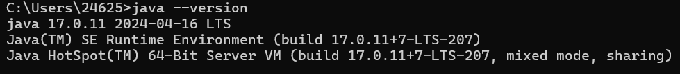
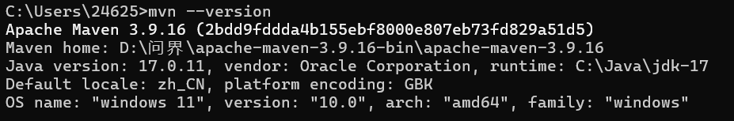
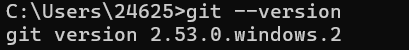
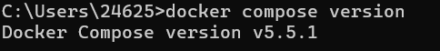

# 作业 01 提交：开发环境与个人仓库

| 项目 | 内容 |
| --- | --- |
| 姓名 | 区恩善 |
| 学号 | 2420100402 |
| 课程 | 微服务架构 |
| 周次 | week-01 |
| 提交日期 | 2026-09-21 |

> **待补截图**：本文件共引用 7 张截图，其中 4 张已就位
> （`java-version.png`、`mvn-version.png`、`git-version.png`、`docker-compose-version.png`）；
> 另 3 张待补：`github-repo.png`（仓库页面）、`git-log-graph.png`（提交记录）、
> `docker-version.png`（守护进程正常后含 `Server` 段的输出）。
> 截图统一放在 `docs/homework/week-01/screenshots/` 目录下，用相对路径引用。

---

## 一、GitHub 仓库链接

**https://github.com/enshanou/microservices-practice-2420100402**

仓库为 Public 公开可访问，目录结构符合作业要求：

```text
.
├── README.md
├── docs/
│   └── homework/
│       └── week-01/
│           ├── index.md
│           ├── submission.md
│           └── screenshots/
└── src/
```

文档位于 `docs/homework/week-01/index.md`，包含「环境检查」「概念回答」「问题记录」三个二级标题。

---

## 二、GitHub 仓库页面截图


仓库状态为 **Public**，分支 `main`，根目录含 `docs/`、`src/`、`README.md`，
右上角显示共 7 次提交。

---

## 三、提交记录截图


提交记录文字版（便于对照）：

| 提交哈希 | 说明 |
| --- | --- |
| `6e7b553` | docs(week-01): 补充作业截图 |
| `542e322` | docs(week-01): 改为截图占位，补充截图清单 |
| `fcc86b0` | docs(week-01): 更新提交记录截图 |
| `8ddf680` | docs(week-01): 添加作业截图与提交说明文档 |
| `5c8999c` | docs(week-01): 补充微服务概念回答与问题记录 |
| `c29915b` | docs(week-01): 添加开发环境检查记录 |
| `09b54bf` | chore: 初始化课程仓库目录结构 |
| `a8424fd` | Initial commit（GitHub 创建仓库时自动生成） |

本次作业新增 7 次提交，满足「至少 2 次提交」的要求。提交粒度按
「结构 → 环境检查 → 概念与问题 → 截图与说明」划分，便于逐条回溯。

---

## 四、环境版本检查截图

> 五条命令在同一终端窗口依次执行并截图，版本信息与系统环境一目了然。
> 注意在 Git Bash 中执行 Maven 命令需使用 `mvn.cmd`（原因见第六节问题 1）；
> 若使用 PowerShell 或 cmd，直接执行 `mvn --version` 即可。

### 1. Java



本机实测结果：

```text
java 17.0.11 2024-04-16 LTS
Java(TM) SE Runtime Environment (build 17.0.11+7-LTS-207)
Java HotSpot(TM) 64-Bit Server VM (build 17.0.11+7-LTS-207, mixed mode, sharing)
```

结论：Java 17 LTS 安装正常。

### 2. Maven



本机实测结果：

```text
Apache Maven 3.9.16 (2bdd9fddda4b155ebf8000e807eb73fd829a51d5)
Maven home: D:\问界\apache-maven-3.9.16-bin\apache-maven-3.9.16
Java version: 17.0.11, vendor: Oracle Corporation, runtime: C:\Java\jdk-17
Default locale: zh_CN, platform encoding: GBK
OS name: "windows 11", version: "10.0", arch: "amd64", family: "windows"
```

结论：Maven 3.9.16 安装正常，`Maven home` 与 `Java version` 均被正确识别。

### 3. Git



本机实测结果：

```text
git version 2.55.0.windows.3
```

结论：Git 安装正常，已配置全局身份 `enshanou`。

### 4. Docker


本机实测结果：

```text
Client:
 Version:           29.8.0
 API version:       1.56
 Go version:        go1.26.8
 Git commit:        88096ef
 Built:             Thu Sep  3 21:53:38 2026
 OS/Arch:           windows/amd64
 Context:           desktop-linux
failed to connect to the docker API at npipe:////./pipe/dockerDesktopLinuxEngine;
check if the path is correct and if the daemon is running:
open //./pipe/dockerDesktopLinuxEngine: The system cannot find the file specified.
```

> **关于 Docker 的说明**
>
> 客户端 29.8.0 与 Compose 插件均已正确安装，报错原因是 **Docker Desktop 未启动**，
> 命名管道 `npipe:////./pipe/dockerDesktopLinuxEngine` 尚未创建。
>
> - 当前系统版本：Windows 11（10.0.26200.8655，amd64）
> - 解决计划：启动 Docker Desktop 并等待引擎就绪，再执行 `docker version` 确认出现 Server 段；
>   之后用 `docker run --rm hello-world` 验证，并在设置中开启开机自启。
> - 兜底方案：若本机始终无法启动，改用 `DOCKER_HOST` 指向远程 Docker 引擎。
> - 影响评估：本次作业仅要求完成环境检查，不要求跑通容器，不影响本次作业完成度。

### 5. Docker Compose



本机实测结果：

```text
Docker Compose version v5.5.1
```

结论：Docker Compose 插件安装正常。

### 环境检查汇总

| 工具 | 版本 | 状态 |
| --- | --- | --- |
| Java | 17.0.11 LTS | 正常 |
| Maven | 3.9.16 | 正常（需用 `mvn.cmd`） |
| Git | 2.55.0.windows.3 | 正常 |
| Docker | Client 29.8.0 | 客户端正常，守护进程待启动 |
| Docker Compose | v5.5.1 | 正常 |

---

## 五、本周文字说明

本周完成了课程开发环境的检查。Java 17.0.11、Maven 3.9.16、Git 2.55.0 与 Docker Compose v5.5.1 均已验证可用；Docker 客户端正常，但守护进程未启动，已记录原因与解决计划。排查中还发现一个隐蔽问题：在 Git Bash 下执行 mvn 会因路径格式不兼容而报类加载异常，改用 mvn.cmd 后恢复正常，说明环境检查不能只看版本号，必须真正跑通命令。本次作业让我理解了微服务与单体架构在部署、数据与扩展方式上的取舍，也认识到可重复运行的验证脚本对后续作业的价值。

---

## 六、问题记录摘要

### 问题 1：Git Bash 中 mvn 报类加载异常

- **现象**：`ClassNotFoundException: org.codehaus.plexus.classworlds.launcher.Launcher`
- **根因**：Git Bash（MINGW64）下命中的是 Maven 的 POSIX 脚本 `bin/mvn`，它把 `/d/问界/...`
  这类 Unix 路径直接传给 Windows 版 JVM，JVM 无法识别，因而找不到 `plexus-classworlds` jar。
  **与 Maven 安装是否完整无关**（已确认安装目录完整）。
- **验证**：同一环境下执行 `mvn.cmd --version` 输出完全正常；用 Windows 风格路径手工构造等价的
  java 启动命令亦可成功运行，双向确认根因是路径格式。
- **解决**：Git Bash 中统一使用 `mvn.cmd`；可加 `alias mvn='mvn.cmd'` 长期生效。

### 问题 2：Docker 守护进程未启动

- **现象**：`failed to connect to the docker API at npipe:////./pipe/dockerDesktopLinuxEngine`
- **根因**：Docker Desktop 采用 C/S 架构，`docker` 仅为客户端，引擎运行在 Docker Desktop 启动的
  Linux 虚拟机中；当前 Docker Desktop 未启动，命名管道不存在，故连接失败。
- **解决计划**：启动 Docker Desktop → 等待鲸鱼图标变绿 → 重新执行 `docker version` 确认出现 Server 段
  → 用 `docker run --rm hello-world` 验证 → 开启开机自启；兜底方案为改用远程 Docker 主机。

---

完整的环境检查原始输出、四个概念题的详细回答以及两个问题的完整排查过程，见
[`index.md`](index.md)。
