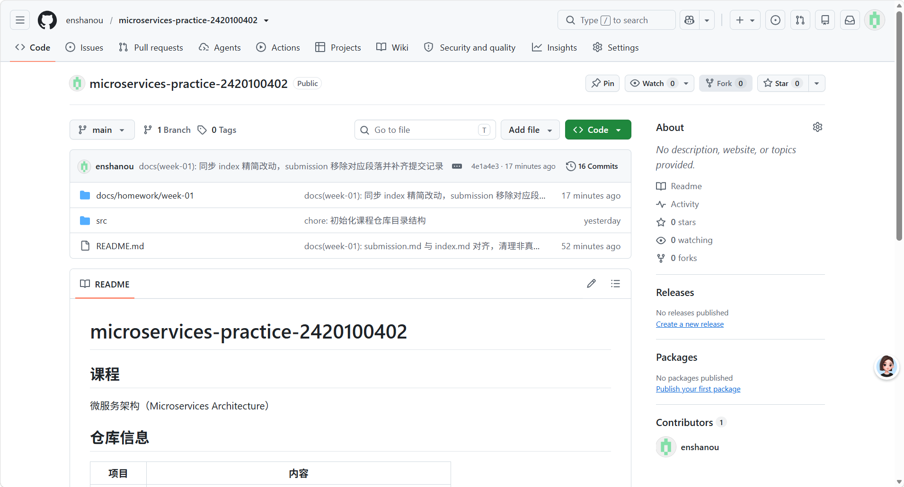
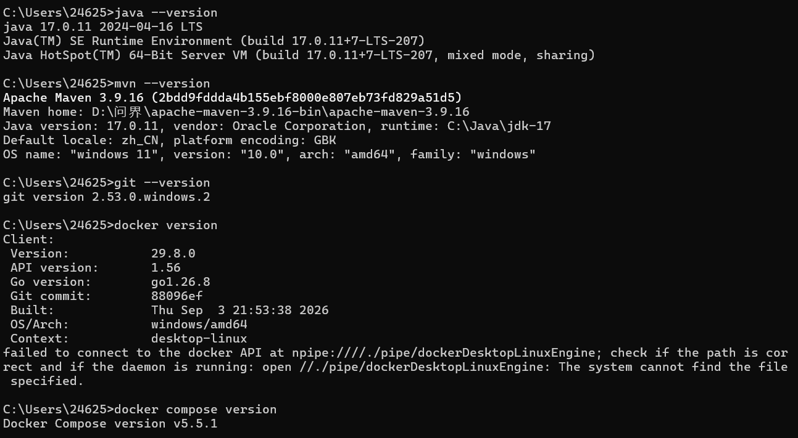

# 作业 01 提交：开发环境与个人仓库

| 项目 | 内容 |
| --- | --- |
| 姓名 | 区恩善 |
| 学号 | 2420100402 |
| 课程 | 微服务架构 |
| 周次 | week-01 |
| 提交日期 | 2026-09-22 |

> 本文件是**提交说明**，用于快速核对「交了什么、放在哪里」。
> 完整的环境检查原始输出、四个概念题的详细回答、两个问题的完整排查过程，
> 全部见 [`index.md`](index.md)。本文件与 index.md 内容一致，不存在仅此一处的结论。

---

## 一、GitHub 仓库链接

**https://github.com/enshanou/microservices-practice-2420100402**

仓库为 Public 公开可访问，目录结构符合作业要求：

```text
.
├── README.md                            # 课程、姓名、学号、仓库用途
├── docs/
│   └── homework/
│       └── week-01/
│           ├── index.md                 # 环境检查 + 概念回答 + 问题记录
│           ├── submission.md            # 本文件：提交说明
│           └── screenshots/
│               ├── environment-check.png
│               └── github-repo.png
└── src/                                 # 后续作业的源代码
```

`docs/homework/week-01/index.md` 包含「环境检查」「概念回答」「问题记录」三个二级标题。

---

## 二、GitHub 仓库页面



截图取自仓库首页，可核对以下要点：

| 核对项 | 截图中的体现 |
| --- | --- |
| 仓库公开 | 标题栏显示 **Public** |
| 默认分支 | **main**（1 Branch、0 Tags） |
| 目录结构 | 根目录含 `docs/homework/week-01`、`src`、`README.md` |
| README 渲染 | 页面下方正常显示姓名、学号、仓库地址表格 |
| 提交留痕 | 右侧计数 **16 Commits**，最新一条为 `4e1a4e3` |

---

## 三、提交记录

```text
$ git log --oneline
4e1a4e3 docs(week-01): 同步 index 精简改动，submission 移除对应段落并补齐提交记录
96b42c1 docs(week-01): 问题1 补充「输出与 cmd 一致即成功」的判断标准
8ba58c8 docs(week-01): 补充 GitHub 仓库页面真实截图，提交记录同步至 13 次
9dc7ac1 docs(week-01): 问题1 补充证据边界说明，避免与环境检查截图混淆
3a206ff docs(week-01): submission.md 与 index.md 对齐，清理非真实截图
5cb31b1 docs(week-01): 环境检查改用同一窗口的五命令截图
58af8e5 docs(week-01): 问题1 补充已落地的别名配置与实测验证结果
32b0758 docs(week-01): 截图改用相对路径，补充 Docker 守护进程问题排查
6e7b553 docs(week-01): 补充作业截图
542e322 docs(week-01): 改为截图占位，补充截图清单
fcc86b0 docs(week-01): 更新提交记录截图
8ddf680 docs(week-01): 添加作业截图与提交说明文档
5c8999c docs(week-01): 补充微服务概念回答与问题记录
c29915b docs(week-01): 添加开发环境检查记录
09b54bf chore: 初始化课程仓库目录结构
a8424fd Initial commit（GitHub 创建仓库时自动生成）
```

| 提交哈希 | 日期 | 说明 |
| --- | --- | --- |
| `4e1a4e3` | 2026-09-22 | 同步 index 精简改动，submission 移除对应段落并补齐提交记录 |
| `96b42c1` | 2026-09-22 | 问题 1 补充「输出与 cmd 一致即成功」的判断标准 |
| `8ba58c8` | 2026-09-22 | 补充 GitHub 仓库页面真实截图，提交记录同步至 13 次 |
| `9dc7ac1` | 2026-09-22 | 问题 1 补充证据边界说明，避免与环境检查截图混淆 |
| `3a206ff` | 2026-09-22 | submission.md 与 index.md 对齐，清理非真实截图 |
| `5cb31b1` | 2026-09-22 | 环境检查改用同一窗口的五命令截图 |
| `58af8e5` | 2026-09-21 | 问题 1 补充已落地的别名配置与实测验证结果 |
| `32b0758` | 2026-09-21 | 截图改用相对路径，补充 Docker 守护进程问题排查 |
| `6e7b553` | 2026-09-21 | 补充作业截图 |
| `542e322` | 2026-09-21 | 改为截图占位，补充截图清单 |
| `fcc86b0` | 2026-09-21 | 更新提交记录截图 |
| `8ddf680` | 2026-09-21 | 添加作业截图与提交说明文档 |
| `5c8999c` | 2026-09-21 | 补充微服务概念回答与问题记录 |
| `c29915b` | 2026-09-21 | 添加开发环境检查记录 |
| `09b54bf` | 2026-09-21 | 初始化课程仓库目录结构 |
| `a8424fd` | 2026-09-14 | Initial commit（GitHub 创建仓库时自动生成） |

仓库累计 16 次提交，其中**本次作业新增 15 次**，满足「至少 2 次提交」的要求。
提交粒度按「结构 → 环境检查 → 概念与问题 → 排查记录 → 文档定稿 → 截图」划分，便于逐条回溯。

---

## 四、环境检查

五条命令在**同一个 cmd.exe 窗口**中依次执行并截图，版本信息一屏可对照：



实测结果汇总：

| 工具 | 命令 | 实测版本 | 状态 |
| --- | --- | --- | --- |
| Java | `java --version` | 17.0.11 LTS (2024-04-16) | 正常 |
| Maven | `mvn --version` | Apache Maven 3.9.16 | 正常（Git Bash 下需用 `mvn.cmd`） |
| Git | `git --version` | 2.53.0.windows.2 | 正常 |
| Docker | `docker version` | Client 29.8.0 | 客户端正常，**守护进程未启动** |
| Docker Compose | `docker compose version` | v5.5.1 | 正常 |

> 说明：截图中的 `mvn --version` 是在 cmd.exe 下执行的。
> 在 Git Bash 中直接执行 `mvn` 会报类加载异常，原因与解决方式见第六节问题 1。

### 关于 Docker 的说明

`docker` 客户端 29.8.0 与 Compose 插件 v5.5.1 均已正确安装，
报错原因是**守护进程未启动**，命名管道 `npipe:////./pipe/dockerDesktopLinuxEngine` 尚未创建。
进一步排查发现根因是系统组件存储损坏导致 WSL2 无法启用，详见第六节问题 2。

---

## 五、本周文字说明

本周完成了课程开发环境的检查。Java 17.0.11、Maven 3.9.16、Git 2.53.0 与 Docker Compose v5.5.1 均已验证可用；Docker 客户端正常，但守护进程未启动，已记录原因与解决计划。排查中还发现一个隐蔽问题：在 Git Bash 下执行 mvn 会因路径格式不兼容而报类加载异常，改用 mvn.cmd 后恢复正常，说明环境检查不能只看版本号，必须真正跑通命令。本次作业让我理解了微服务与单体架构在部署、数据与扩展方式上的取舍，也认识到可重复运行的验证脚本对后续作业的价值。

---

## 六、问题记录摘要

### 问题 1：Git Bash 中执行 `mvn --version` 报类找不到异常

- **现象**：`ClassNotFoundException: org.codehaus.plexus.classworlds.launcher.Launcher`
- **根因**：Git Bash（MINGW64）下命中的是 Maven 的 POSIX 脚本 `bin/mvn`，它把 `/d/问界/...`
  这类 Unix 路径直接传给 Windows 版 JVM，JVM 无法识别，因而找不到 `plexus-classworlds` jar。
  **与 Maven 安装是否完整无关**（已确认安装目录完整）。
- **验证**：同一环境下执行 `mvn.cmd --version` 输出完全正常；用 Windows 风格路径手工构造等价的
  java 启动命令亦可成功运行，双向确认根因是路径格式。
- **解决**：Git Bash 中统一使用 `mvn.cmd`。本机已在 `~/.bashrc` 中配置 `alias mvn='mvn.cmd'`
  并实测生效（同时显式创建了 `~/.bash_profile` 以确保 `.bashrc` 被加载）。
- **遗留风险**：`alias` 只在**交互式 shell** 中展开，脚本（CI、`bash xxx.sh`）里调用 `mvn`
  仍会踩坑，这类场景需显式写 `mvn.cmd`。

### 问题 2：Docker 守护进程未启动

- **现象**：`failed to connect to the docker API at npipe:////./pipe/dockerDesktopLinuxEngine`
- **排查**：客户端与 Compose 插件均正常 → `com.docker.service` 服务不存在 → `wsl --status`
  提示子系统未安装 → 检查发现 `VirtualMachinePlatform` 与 `Microsoft-Windows-Subsystem-Linux`
  两个可选功能均为 Disabled → 尝试启用时报「组件存储已损坏」。
- **根因**：这是一条依赖链 —— Docker Desktop 引擎依赖 WSL2，WSL2 依赖上述两个 Windows 功能，
  而这些功能依赖健康的组件存储（WinSxS）。本机组件存储损坏，功能无法启用，引擎自然起不来。
  「守护进程未启动」只是最表层的表现。
- **尝试修复并失败**：执行 `Repair-WindowsImage -Online -RestoreHealth`（跑了约 3.5 小时、
  下载 1.8 GB 组件包）后失败，报 `0x800f0915 CBS_E_REPAIR_CONTENT_MISSING`；
  随后 DISM 自动重试陷入死循环，反复报 `0x800F0950 CBS_E_NO_OPTIONAL_CONTENT_FOUND_FOR_BUILD`。
  底层是 `CorruptManifest`（组件清单损坏）且系统同时存在 `10.0.26100.x` 与 `10.0.27000.x`
  两个版本区间的包，处于**跨版本撕裂**状态，Windows Update 无法提供匹配 build 的修复内容。
- **下一步可行方案**：**就地升级修复安装**（下载 Windows 11 ISO → 运行 `setup.exe` →
  选「保留个人文件和应用」），用健康文件替换损坏组件并消除跨版本撕裂；之后启用
  `VirtualMachinePlatform` 与 `Microsoft-Windows-Subsystem-Linux`，安装 WSL2 并启动 Docker Desktop。
  本机为家庭版，不含 Hyper-V，**没有备选后端**。

---

## 七、可复现性说明

本次环境检查的命令均为可重复执行的标准命令，任何人在同类环境下重新执行都能得到相同结论：

```bash
java --version
mvn --version        # Git Bash 下请用 mvn.cmd
git --version
docker version
docker compose version
```

四个概念题的详细回答、组件存储损坏的完整日志证据与错误码对照表，
见 [`index.md`](index.md)。
