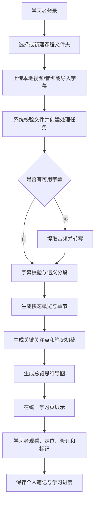

# Week 02：项目选题与功能规划

## 一、项目选题

### 1. 最终选题

**项目名称：课览 CourseLens**  
**项目定位：面向视频课程的智能预习与可编辑笔记工作台。**

课览面向高校学生、自学者和职业学习者，解决观看网课时“不了解课程全貌、频繁暂停抄写、笔记与视频脱节、课后难以结构化复习”等实际问题。系统允许学习者导入自己有权处理的本地视频、音频或字幕，异步完成文本转写与语义分段，在观看前生成课程概览、章节路线和关键关注点，在观看过程中提供带时间定位的 AI 笔记初稿，并在观看后形成可复习的思维导图。学习者不必从零抄写，而是围绕 AI 初稿核对、修改和补充，把更多注意力用于理解原理、判断准确性和形成个人认识。

选择该题目主要有三点原因：第一，它来自真实且高频的学习场景，核心价值不是简单保存视频，而是提高预习、理解和笔记整理效率；第二，学习者、管理员和内容处理组件具有不同职责，课程资源、处理任务、字幕片段、AI 内容与个人修订之间存在清晰的业务关系；第三，项目可以从模块化单体开始，逐步加入数据库持久化、认证授权、异步消息、服务拆分、事务一致性、监控和容器化部署，能够连续支撑本学期后续课程任务。

### 2. 目标用户及需求

| 用户或参与方 | 主要需求 |
| --- | --- |
| 学习者 | 观看前了解课程主题、章节和重点；减少暂停抄写；在 AI 笔记初稿上修订；点击笔记或导图定位原视频；管理并按需共享学习资料 |
| 管理员 | 管理用户与资源状态；查看处理任务、失败原因和重试记录；终止异常任务；查看运行指标和审计记录 |
| 内容处理组件 | 以处理任务为单位完成媒体预处理、转写、章节切分、概览/笔记/导图生成，并回传可追踪状态 |

### 3. 初步边界

当前阶段聚焦完整且可演示的学习闭环：

1. 支持用户有权处理的本地视频、音频和字幕文本；
2. 生成课程概览、章节、关键关注点、结构化笔记初稿和思维导图；
3. 支持笔记修订、来源追溯和视频时间定位；
4. 以异步任务展示处理进度、失败原因和重试状态；
5. 区分 AI 初稿和个人修订，重新生成时不覆盖个人内容。

当前不把系统做成任意第三方平台视频下载器，不绕过登录、会员、地区、版权或访问限制；本周不要求完成 Java 业务代码，也不在第一阶段实现复杂问答、模型训练、GPU 集群和完整社区推荐算法。

### 4. 选题确定过程

最初考虑过宠物医院、购物、图书借阅、健身房和餐厅等常见管理系统，但这些选题与个人真实需求联系较弱，容易只停留在普通增删改查。随后提出“网课学习工作台”的构想，希望从 Bilibili、抖音和 YouTube 等平台导入课程并自动生成学习资料。分析后发现，多平台视频下载会受到接口变化、登录权限、反爬和版权规则影响，容易让课程项目的重点偏离微服务业务设计。

最终把第一阶段收敛为“本地上传或字幕导入 → 转写与分段 → 课前预览 → AI 笔记初稿 → 个人修订 → 思维导图”，把平台接入保留为后续可替换的输入适配器。项目名称确定为“课览 CourseLens”，强调先了解课程全貌和重点，再进入正式学习。

---

## 二、功能规划

### 1. 项目目标和适用场景

项目目标是把视频课程从线性媒体转化为可预览、可定位、可编辑和可复习的学习资料，适用于高校课程、公开课、考试辅导、技术教程、岗位培训和用户自己录制的讲解视频。

核心价值排序如下：

1. 课前预览与 AI 笔记初稿并列为最高优先级；
2. 思维导图用于总结课程结构和课后复习；
3. 社区共享、相关推荐和个性化输出风格作为后续增强能力。

### 2. 功能模块

| 模块 | 主要功能 | 当前优先级 |
| --- | --- | --- |
| 用户与权限 | 注册登录、学习者/管理员角色、资源级访问控制、敏感操作审计 | P0 |
| 课程资源 | 本地视频/音频上传、字幕导入、文件校验、课程信息、文件夹归类 | P0 |
| 处理任务 | 创建异步任务、状态跟踪、失败原因、自动/人工重试、幂等控制 | P0 |
| 课程预览 | 快速概览、章节路线、关键关注点、来源片段和时间范围 | P0 |
| AI 笔记 | 结构化初稿、重点粗体、时间戳关联、个人修订、AI/个人内容分层 | P0 |
| 思维导图 | 课程—章节—知识点层级、节点折叠、内容联动和视频定位 | P0/P1 |
| 学习体验 | 统一学习页、播放进度联动、掌握/复习/疑问标记、学习进度 | P0/P1 |
| 社区与推荐 | 分层共享 AI 内容或个人笔记、公开内容浏览、相关课程与笔记推荐 | P1 |
| 管理与运营 | 用户和资源治理、任务管理、通知、指标与审计 | P0/P1 |

### 3. 核心业务流程

处理失败时，系统保留已成功阶段的结果，记录失败阶段和原因；暂时性错误可自动重试，学习者或管理员也可按权限发起有限次数的人工重试。重新处理只生成新的 AI 版本，不覆盖学习者已经保存的个人修订。

### 4. 当前范围与暂不实现内容

**本学期优先实现：**本地文件或字幕输入、异步任务、转写/分段、课程预览、AI 笔记、思维导图、统一学习页、个人修订、认证授权和管理端基础能力。

**暂不实现：**任意平台视频下载、绕过平台限制、复杂 RAG 问答、模型微调、GPU 集群、成熟内容社区和复杂推荐算法。富文本编辑、共享推荐和个性化输出风格在核心闭环稳定后逐步加入。

### 5. 后续演进方向

| 课程方向 | 项目中的演进内容 |
| --- | --- |
| 数据库持久化 | 持久化用户、课程、任务、字幕片段、AI 版本、个人笔记、导图、共享策略和审计记录 |
| 认证与授权 | 登录认证、角色权限、资源级授权、管理员操作审计 |
| 服务拆分 | 按用户权限、课程资源、任务处理、内容生成、学习内容、通知等业务边界拆分 |
| 消息通信 | 使用领域事件传递资源上传、转写完成、生成完成、任务失败和通知消息 |
| 事务一致性 | 通过状态机、幂等键、事件记录和失败补偿保证跨服务最终一致性 |
| 监控 | 采集任务成功率、处理耗时、失败类型、队列积压、存储容量和链路日志 |
| 部署 | 使用容器部署应用、数据库、对象存储和消息组件，通过环境变量管理配置与密钥 |

### 6. 本周完成内容

- 确定本学期唯一项目题目“课览 CourseLens”；
- 明确业务背景、目标用户、核心价值、初步范围和非目标；
- 完善根目录 `README.md` 的项目简介、适用场景、角色、模块、核心流程和演进方向；
- 使用 Markdown 表格和 Mermaid 流程图组织项目说明；
- 形成后续需求分析、交互设计、领域建模和实现阶段的统一项目基线。

### 7. 后续计划

1. 检查 GitHub 页面中 README 的 Mermaid 图表能否正常渲染；
2. 完成五条核心用户流程的正常路径与异常路径设计；
3. 绘制统一学习页低保真原型；
4. 完成领域模型、数据关系和权限矩阵；
5. 在上述设计稳定后进行总体架构与模块边界复审；
6. 按课程安排实现模块化单体，再逐步完成持久化、认证、消息、服务拆分、监控和部署。

